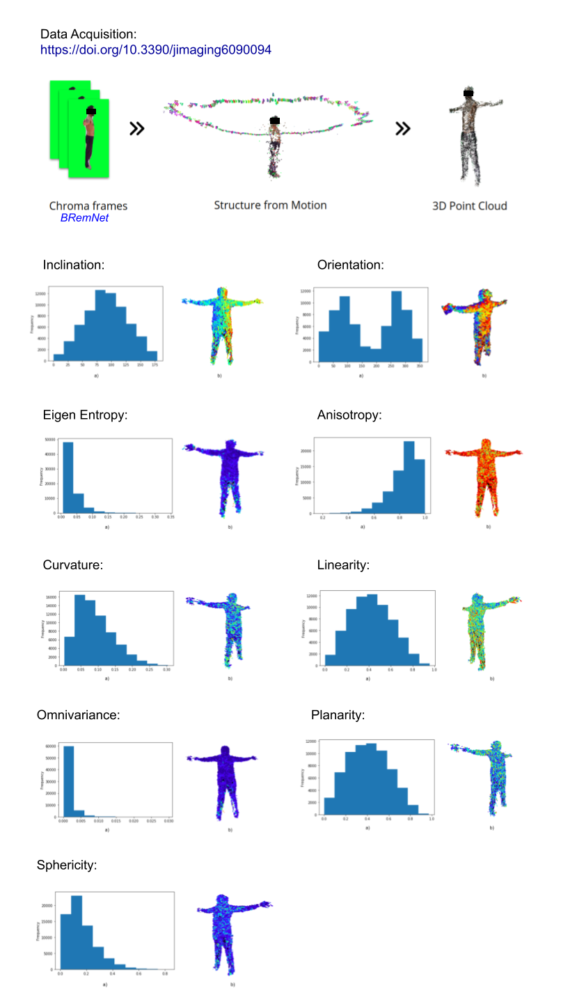

# PointCloud-Descriptors
3D Point Cloud Descriptors | V Encuentro Nacional de Morfometría (2019)



## Installation
### Prerequisites
Install [pyntcloud](https://github.com/daavoo/pyntcloud) via conda:
```
conda install pyntcloud -c conda-forge
```
Or using pip:
```
pip install pyntcloud
```

### Cloning
```
git clone https://github.com/aletrujim/PointCloud-Descriptors.git PointCloudDescriptors
```

## Data adquisition
The data used in this analysis were acquired with *BRemNet* (Background Removal Network) from [*body2vec*](https://doi.org/10.3390/jimaging6090094).
If you use this data or the method for acquiring your own point clouds dataset in your research, please cite this project.
```
@article{trujillo2020body2vec,
  title={body2vec: 3D Point Cloud Reconstruction for Precise Anthropometry with Handheld Devices},
  author={Trujillo-Jim{\'e}nez, Magda Alexandra and Navarro, Pablo and Pazos, Bruno and Morales, Leonardo and Ramallo, Virginia and Paschetta, Carolina and De Azevedo, Soledad and Ruderman, Anah{\'\i} and P{\'e}rez, Orlando and Delrieux, Claudio and others},
  journal={Journal of Imaging},
  volume={6},
  number={9},
  pages={94},
  year={2020},
  publisher={Multidisciplinary Digital Publishing Institute}
}
```
